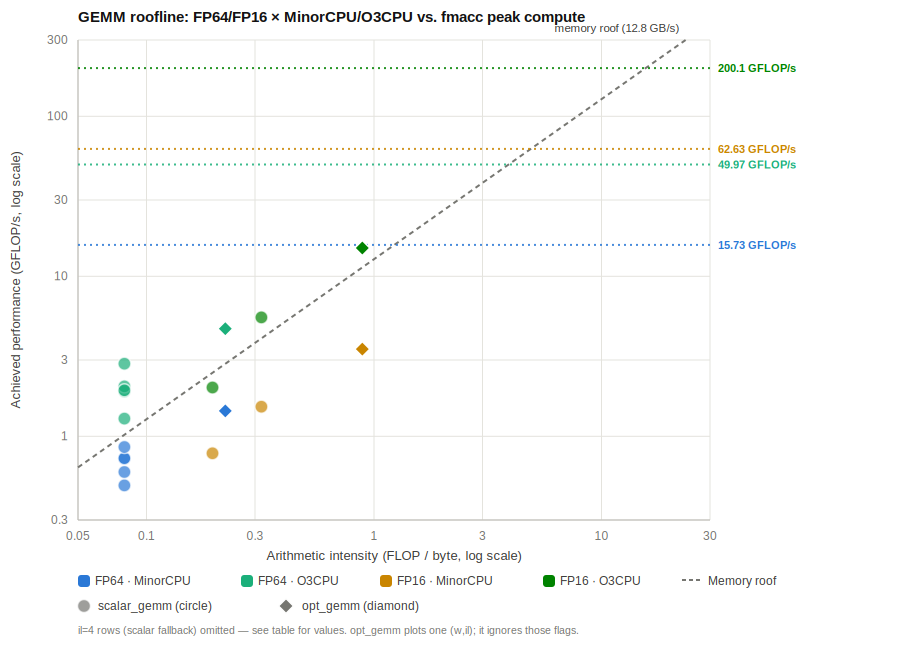

# GEMM sweep roofline analysis (FP64/FP16 × MinorCPU/O3CPU)

Data from `test/sweep.py` driven by `test/config/sweep_config.json` (all
eight variants enabled: `fp64_minor`, `fp64_o3`, `fp16_minor`, `fp16_o3`, and
their `*_opt` counterparts), plotted against the compute-roof ceilings
measured in [microbenchmark.md](microbenchmark.md)'s `fmacc`/`fmacc_fp16`
x16-unroll micro-benchmark — not derived from this sweep's own data.

Two kernels are compared: `scalar_gemm` (the original auto-vectorized i-k-j
triple loop) and `opt_gemm` (hand-vectorized with explicit RVV intrinsics,
8-way unrolled across the k-reduction — see "scalar_gemm vs. opt_gemm"
below for why and how much it helps).

> **Note:** the Brain Float series (BF16/BF8) is not covered by this sweep.
> whisper's ISA string already includes `zfbfmin`/`zvfbfmin`/`zvfbfwma`, and
> the Makefile has a `__bf16` build-flag comment (`rv64gcv_zvfbfmin1p0_zvfbfwma1p0`),
> but gem5 doesn't support decoding these RVV BF16 extension instructions in
> this environment — the O3 `CustomFUPool` config lists `SimdBf16*` op
> classes, but that alone doesn't imply the ISA decoder accepts the
> instructions. Without gem5 timing coverage there'd be no cycle-accurate
> half of the comparison, so BF16/BF8 were left out rather than tested
> functionally-only.

Shape: `M=16 K=16` for both dtypes (`shape.m`/`shape.k` in the config); `N` is
derived per dtype as `source_A_width_bits / data_format` (1024/64=16 for FP64,
1024/16=64 for FP16) — so FP64 runs a square `16×16×16` kernel (identical to
the single-config kernel documented in [../README.md](../README.md)), while
FP16's wider `N=64` keeps the two dtypes' input-array footprint identical:
with `source_A_width_bits=1024` shared, `il=1` memory traffic (`Q`) comes out
to the same 102,400 bytes for both dtypes. Memory peak = 12.8 GB/s
(DDR3-1600 8×8).

An interactive log-log version of this chart (with hover tooltips) is
also available as a Claude artifact; the static plot above and the table
below are the durable, in-repo copy of the same data.

## Compute-roof ceilings used

| Config | Compute roof | Source |
|---|---|---|
| FP64 MinorCPU | 15.73 GFLOP/s | microbenchmark.md's designated default ceiling (x16 unroll, 98.3% of 16.0 GFLOP/s theoretical, vl=8, 1 FloatSimd FU, 1 GHz) |
| FP16 MinorCPU | 62.63 GFLOP/s | same benchmark, vl=32 (97.9% of 64.0 GFLOP/s theoretical) |
| FP64 O3CPU | 49.97 GFLOP/s | derived from microbenchmark.md's O3CPU mcycle=3,202 (10,000 total_ops, stock O3 functional-unit pool — `O3_SIMD_FMA_OPLAT` unset, defaults to 1 — matching this sweep's O3 config exactly) |
| FP16 O3CPU | 200.1 GFLOP/s | derived from microbenchmark.md's O3CPU mcycle=3,198 (same stock config) |

**Caveat on the O3 ceilings:** microbenchmark.md flags the stock O3 config as
carrying a known modeling gap — gem5's default O3 functional-unit pool
assumes a 1-cycle vector FMA (`opLat=1`) vs. MinorCPU's deliberately
configured 6-cycle latency, inflating the stock O3 ceiling ~5–6× relative to
a latency-matched comparison. With `opLat` matched to Minor's 6, the doc
measures a *fair* FP64 O3 ceiling of **41.86 GFLOP/s** (a genuine 2.66× OoO
advantage over Minor's 15.73, from 4 SIMD ports vs Minor's 1) — no matched
FP16 figure exists in the doc, so it isn't used here. Either way, the sweep's
GEMM points are so deep in the memory-bound region (AI 0.080–0.320, ridge
points at 3.9/15.6 FLOP/B) that this ceiling choice doesn't change the
qualitative conclusion below.

## Full sweep results

`Attainable` is the memory-bound roofline value at this row's AI —
`AI × 12.8 GB/s` — i.e. the slope-line ceiling that actually applies here,
since every row's AI sits far left of its ridge point (see below). `mem%` is
achieved GFLOP/s against *that* ceiling, and `roof%` is achieved GFLOP/s
against the compute-roof ceiling from the table above; `roof% = mem% ×
(AI / ridge_point)`, i.e. `roof%` is just `mem%` rescaled by how far below
the ridge point this kernel's AI sits.

| Config | core | kernel | w  | il | mcycle  | AI (FLOP/B) | GFLOP/s | Attainable | mem%   | Compute roof | roof% |
|---|---|---|---|---|---:|---:|---:|---:|---:|---:|---:|
| FP64 | minor | scalar | 4  | 1 | 16,599  | 0.080 | 0.4935 | 1.024 | 48.19%  | 15.73  | 3.14% |
| FP64 | minor | scalar | 4  | 2 | 13,687  | 0.080 | 0.5985 | 1.024 | 58.44%  | 15.73  | 3.80% |
| FP64 | minor | scalar | 4  | 4 | 11,308  | 0.080 | 0.7244 | 1.024 | 70.74%  | 15.73  | 4.61% |
| FP64 | minor | scalar | 8  | 1 | 11,224  | 0.080 | 0.7299 | 1.024 | 71.28%  | 15.73  | 4.64% |
| FP64 | minor | scalar | 8  | 2 | 9,553   | 0.080 | 0.8575 | 1.024 | 83.74%  | 15.73  | 5.45% |
| FP64 | minor | scalar | 8  | 4 | 56,420  | N/A*  | 0.1452 | N/A*  | N/A*    | 15.73  | 0.92% |
| FP64 | o3    | scalar | 4  | 1 | 6,342   | 0.080 | 1.2917 | 1.024 | 126.14% | 49.97  | 2.58% |
| FP64 | o3    | scalar | 4  | 2 | 4,289   | 0.080 | 1.9100 | 1.024 | 186.55% | 49.97  | 3.82% |
| FP64 | o3    | scalar | 4  | 4 | 3,990   | 0.080 | 2.0531 | 1.024 | 200.50% | 49.97  | 4.11% |
| FP64 | o3    | scalar | 8  | 1 | 4,225   | 0.080 | 1.9389 | 1.024 | 189.34% | 49.97  | 3.88% |
| FP64 | o3    | scalar | 8  | 2 | 2,881   | 0.080 | 2.8435 | 1.024 | 277.68% | 49.97  | 5.69% |
| FP64 | o3    | scalar | 8  | 4 | 23,164  | N/A*  | 0.3537 | N/A*  | N/A*    | 49.97  | 0.71% |
| FP16 | minor | scalar | 32 | 1 | 21,378  | 0.320 | 1.5328 | 4.096 | 37.42%  | 62.63  | 2.45% |
| FP16 | minor | scalar | 32 | 2 | 41,843  | 0.195 | 0.7831 | 2.496 | 31.37%  | 62.63  | 1.25% |
| FP16 | minor | scalar | 32 | 4 | 357,561 | N/A*  | 0.0916 | N/A*  | N/A*    | 62.63  | 0.15% |
| FP16 | o3    | scalar | 32 | 1 | 5,915   | 0.320 | 5.5398 | 4.096 | 135.25% | 200.1  | 2.77% |
| FP16 | o3    | scalar | 32 | 2 | 16,226  | 0.195 | 2.0195 | 2.496 | 80.91%  | 200.1  | 1.01% |
| FP16 | o3    | scalar | 32 | 4 | 221,884 | N/A*  | 0.1477 | N/A*  | N/A*    | 200.1  | 0.07% |
| FP64 | minor | **opt** | 8  | 1 | **5,684** | 0.222 | **1.4412** | 2.844 | 50.68%  | 15.73  | **9.16%** |
| FP64 | o3    | **opt** | 8  | 1 | **1,741** | 0.222 | **4.7053** | 2.844 | 165.44% | 49.97  | **9.42%** |
| FP16 | minor | **opt** | 32 | 1 | **9,343** | 0.889 | **3.5072** | 11.378 | 30.83%  | 62.63  | **5.60%** |
| FP16 | o3    | **opt** | 32 | 1 | **2,179** | 0.889 | **15.0381** | 11.378 | 132.20% | 200.1  | **7.52%** |

\* `il=4` rows compiled to scalar code (no vector load/store instructions
retired), so arithmetic intensity is undefined on this vector-AI axis;
GFLOP/s and roof-% are still shown for reference, but `Attainable`/`mem%`
have no defined value without a vector AI. `opt_gemm` sweeps only one
`(w, il)` per variant since it's hand-vectorized (fixed `vlmax`, unroll
fixed at compile time) — those LLVM flags don't affect its codegen at all,
unlike `scalar_gemm`'s auto-vectorized loop.

**`mem% > 100%` on every O3CPU row** is not a measurement error: this
kernel's working set (~6–16 KB of A/B/C) fits entirely in the 64 KB L1
cache, so O3CPU's real sustained bandwidth is well above the 12.8 GB/s
DRAM-peak figure that `Attainable` assumes — meaning O3 isn't actually
bandwidth-bound on this kernel at all, unlike MinorCPU where `mem%` stays
under 100% and roughly tracks classic roofline behavior.

FP64's `minor, scalar, w=8, il=2` row (mcycle=9,553) is the exact same
kernel documented in [../README.md](../README.md)'s single-config roofline
walkthrough (which reports 9,547) — both use the identical `M=N=K=16` FP64
shape, so the numbers cross-validate; the handful-of-cycles difference is
gem5 scheduling noise between rebuilds, not a real discrepancy.

## scalar_gemm vs. opt_gemm

`scalar_gemm` is the original auto-vectorized i-k-j triple loop; `opt_gemm`
(`src/gemm.c`) is a hand-vectorized rewrite using explicit RVV intrinsics,
built in two steps documented via direct measurement (not just reasoned
about):

1. **Register-resident accumulator.** `scalar_gemm`'s inner loop
   read-modify-writes `C` through memory on *every* `k`-reduction step
   (confirmed via disassembly — `restrict`-qualifying the pointers changed
   nothing, since clang's auto-vectorizer never hoists an accumulator across
   an *enclosing* scalar loop). `opt_gemm` instead loads `C` into a real
   vector-register SSA value once, accumulates across all of `k`, and stores
   once — cutting `VectorStore` from 544→32 and `VectorLoad` from 1056→544,
   which raises `AI` from 0.080→0.222 (FP64) and 0.320/0.195→0.889 (FP16).
2. **8-way unroll.** A single register-resident accumulator still carries a
   serial `vc→vc` dependency chain across all `K=16` reduction steps — the
   same throughput floor `microbenchmark.md` documented for `fmacc`'s
   unoptimized "serial" version. Splitting the reduction across 8
   independent accumulator chains (summed via a pairwise tree afterward,
   mirroring `fmacc.c`'s technique) breaks that chain.

Both steps were verified against `scalar_gemm` for correctness (relative
tolerance 1e-2, to allow for FP re-associativity from the 8-way sum) before
being measured — see `opt_gemm`'s in-binary self-check
(`max relative |C - C_ref|`) printed on every run.

| Config | core | best scalar mcycle | opt mcycle | speedup | best scalar roof% | opt roof% |
|---|---|---:|---:|---:|---:|---:|
| FP64 | minor | 9,553 (w8,il2) | 5,684 | 1.68× | 5.45% | 9.16% |
| FP64 | o3    | 2,881 (w8,il2) | 1,741 | 1.65× | 5.69% | 9.42% |
| FP16 | minor | 21,378 (w32,il1) | 9,343 | 2.29× | 2.45% | 5.60% |
| FP16 | o3    | 5,915 (w32,il1) | 2,179 | 2.71× | 2.77% | 7.52% |

`opt_gemm` roughly doubles `roof%` on FP64 and more than doubles it on
FP16 — a real, verified win — but it's still far from saturating the
compute roof, because unrolling only fixed the *dependency-chain* stall;
`AI` is still an order of magnitude below every ridge point (see Key
finding), so `Attainable` (the memory-bound ceiling) is still the binding
constraint for every `opt_gemm` row on MinorCPU (`mem%` stays under 100%),
and O3's `mem% > 100%` rows show it isn't bandwidth-bound at all — both
point to the fixed per-row loop overhead and `B`'s still-uneliminated
redundant reload across `i` (see the "data reuse" discussion this
investigation started from) as the next limiter, not compute throughput.

## Key finding

Every measured GEMM point sits far left of all four ridge points (where each
ceiling meets the memory-bound diagonal `GFLOP/s = 12.8 × AI`) — this
`M=K=16` problem (FP64 `N=16`, FP16 `N=64`, same 1024-bit input-row budget
for both) is deep in the memory-bound regime on every CPU model and dtype
tested. `scalar_gemm` reaches only **0.1–5.7%** of its own compute roof;
`opt_gemm`'s register-resident-accumulator + 8-way-unroll rewrite roughly
doubles that (up to **9.4%**) by fixing memory traffic and breaking a serial
dependency chain, but is still nowhere near compute-bound — consistent with
microbenchmark.md's conclusion that only compute-bound kernels like `fmacc`
(not `gemm`, even optimized) approach the compute roofline at this problem
size.
