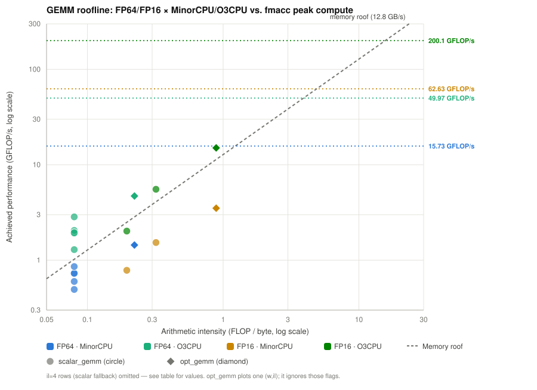
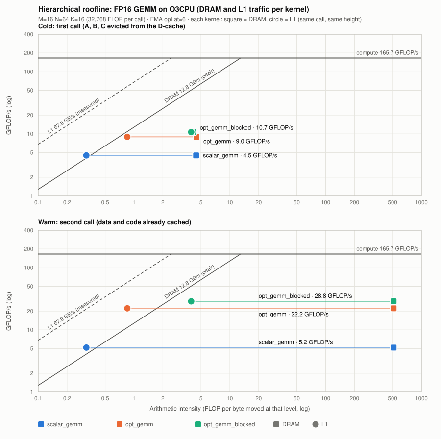

# GEMM sweep roofline analysis (FP64/FP16 × MinorCPU/O3CPU)

Data from `test/sweep.py` driven by `test/config/sweep_config.json` (all
twelve variants enabled: `fp64_minor`, `fp64_o3`, `fp16_minor`, `fp16_o3`,
and their `*_opt`/`*_blocked` counterparts), plotted against the
compute-roof ceilings measured in
[microbenchmark.md](microbenchmark.md)'s `fmacc`/`fmacc_fp16` x16-unroll
micro-benchmark — not derived from this sweep's own data.

Three kernels are compared: `scalar_gemm` (the original auto-vectorized
i-k-j triple loop), `opt_gemm` (hand-vectorized with explicit RVV
intrinsics, 8-way unrolled across the k-reduction), and `opt_gemm_blocked`
(hand-vectorized, all 16 rows blocked into one tile so `B` is loaded once
per `k`-step instead of once per row) — see "scalar_gemm vs. opt_gemm vs.
opt_gemm_blocked" below for why and how much each step helps.

> **Note:** the Brain Float series (BF16/BF8) is not covered by this sweep.
> whisper's ISA string already includes `zfbfmin`/`zvfbfmin`/`zvfbfwma`, and
> the Makefile has a `__bf16` build-flag comment (`rv64gcv_zvfbfmin1p0_zvfbfwma1p0`),
> but gem5 doesn't support decoding these RVV BF16 extension instructions in
> this environment — the O3 `CustomFUPool` config lists `SimdBf16*` op
> classes, but that alone doesn't imply the ISA decoder accepts the
> instructions. Without gem5 timing coverage there'd be no cycle-accurate
> half of the comparison, so BF16/BF8 were left out rather than tested
> functionally-only.

Shape: `M=16 K=16` for both dtypes (`shape.m`/`shape.k` in the config); `N` is
derived per dtype as `source_A_width_bits / data_format` (1024/64=16 for FP64,
1024/16=64 for FP16) — so FP64 runs a square `16×16×16` kernel (identical to
the single-config kernel documented in [../README.md](../README.md)), while
FP16's wider `N=64` keeps the two dtypes' input-array footprint identical:
with `source_A_width_bits=1024` shared, `il=1` memory traffic (`Q`) comes out
to the same 102,400 bytes for both dtypes. Memory peak = 12.8 GB/s
(DDR3-1600 8×8).



An interactive log-log version of this chart (with hover tooltips) is
also available as a Claude artifact; the static plot above and the table
below are the durable, in-repo copy of the same data.

## Compute-roof ceilings used

| Config | Compute roof | Source |
|---|---|---|
| FP64 MinorCPU | 15.73 GFLOP/s | microbenchmark.md's designated default ceiling (x16 unroll, 98.3% of 16.0 GFLOP/s theoretical, vl=8, 1 FloatSimd FU, 1 GHz) |
| FP16 MinorCPU | 62.63 GFLOP/s | same benchmark, vl=32 (97.9% of 64.0 GFLOP/s theoretical) |
| FP64 O3CPU | 49.97 GFLOP/s | derived from microbenchmark.md's O3CPU mcycle=3,202 (10,000 total_ops, stock O3 functional-unit pool — `O3_SIMD_FMA_OPLAT` unset, defaults to 1 — matching this sweep's O3 config exactly) |
| FP16 O3CPU | 200.1 GFLOP/s | derived from microbenchmark.md's O3CPU mcycle=3,198 (same stock config) |

**Caveat on the O3 ceilings:** microbenchmark.md flags the stock O3 config as
carrying a known modeling gap — gem5's default O3 functional-unit pool
assumes a 1-cycle vector FMA (`opLat=1`) vs. MinorCPU's deliberately
configured 6-cycle latency, inflating the stock O3 ceiling ~5–6× relative to
a latency-matched comparison. With `opLat` matched to Minor's 6, the doc
measures a *fair* FP64 O3 ceiling of **41.86 GFLOP/s** (a genuine 2.66× OoO
advantage over Minor's 15.73, from 4 SIMD ports vs Minor's 1) — no matched
FP16 figure exists in the doc, so it isn't used here. `scalar_gemm`/`opt_gemm`
points are so deep in the memory-bound region (AI 0.080–0.889, ridge points
at 1.2–15.6 FLOP/B) that this ceiling choice doesn't change their qualitative
read; `opt_gemm_blocked`'s points sit right at/past the FP64/FP16 MinorCPU
ridge points, so its ceiling *does* matter there — see the Key finding below.

## Full sweep results

`Attainable` is the memory-bound roofline value at this row's AI —
`AI × 12.8 GB/s` — i.e. the slope-line ceiling that applies *when AI is
below the ridge point* (true for every `scalar_gemm`/`opt_gemm` row, and
still true for `opt_gemm_blocked` on O3 in practice — see the `mem%>100%`
note below — but no longer true in principle for `opt_gemm_blocked` on
MinorCPU, whose AI now sits at/past the ridge). `mem%` is achieved GFLOP/s
against `Attainable`, and `roof%` is achieved GFLOP/s against the
compute-roof ceiling from the table above; below the ridge point,
`roof% = mem% × (AI / ridge_point)` — `roof%` is just `mem%` rescaled by how
far below the ridge this kernel's AI sits.

| Config | core | kernel | w  | il | mcycle  | AI (FLOP/B) | GFLOP/s | Attainable | mem%   | Compute roof | roof% |
|---|---|---|---|---|---:|---:|---:|---:|---:|---:|---:|
| FP64 | minor | scalar | 4  | 1 | 16,599  | 0.080 | 0.4935 | 1.024 | 48.19%  | 15.73  | 3.14% |
| FP64 | minor | scalar | 4  | 2 | 13,687  | 0.080 | 0.5985 | 1.024 | 58.44%  | 15.73  | 3.80% |
| FP64 | minor | scalar | 4  | 4 | 11,308  | 0.080 | 0.7244 | 1.024 | 70.74%  | 15.73  | 4.61% |
| FP64 | minor | scalar | 8  | 1 | 11,224  | 0.080 | 0.7299 | 1.024 | 71.28%  | 15.73  | 4.64% |
| FP64 | minor | scalar | 8  | 2 | 9,553   | 0.080 | 0.8575 | 1.024 | 83.74%  | 15.73  | 5.45% |
| FP64 | minor | scalar | 8  | 4 | 56,420  | N/A*  | 0.1452 | N/A*  | N/A*    | 15.73  | 0.92% |
| FP64 | o3    | scalar | 4  | 1 | 6,342   | 0.080 | 1.2917 | 1.024 | 126.14% | 49.97  | 2.58% |
| FP64 | o3    | scalar | 4  | 2 | 4,289   | 0.080 | 1.9100 | 1.024 | 186.55% | 49.97  | 3.82% |
| FP64 | o3    | scalar | 4  | 4 | 3,990   | 0.080 | 2.0531 | 1.024 | 200.50% | 49.97  | 4.11% |
| FP64 | o3    | scalar | 8  | 1 | 4,225   | 0.080 | 1.9389 | 1.024 | 189.34% | 49.97  | 3.88% |
| FP64 | o3    | scalar | 8  | 2 | 2,881   | 0.080 | 2.8435 | 1.024 | 277.68% | 49.97  | 5.69% |
| FP64 | o3    | scalar | 8  | 4 | 23,164  | N/A*  | 0.3537 | N/A*  | N/A*    | 49.97  | 0.71% |
| FP16 | minor | scalar | 32 | 1 | 21,378  | 0.320 | 1.5328 | 4.096 | 37.42%  | 62.63  | 2.45% |
| FP16 | minor | scalar | 32 | 2 | 41,843  | 0.195 | 0.7831 | 2.496 | 31.37%  | 62.63  | 1.25% |
| FP16 | minor | scalar | 32 | 4 | 357,561 | N/A*  | 0.0916 | N/A*  | N/A*    | 62.63  | 0.15% |
| FP16 | o3    | scalar | 32 | 1 | 5,915   | 0.320 | 5.5398 | 4.096 | 135.25% | 200.1  | 2.77% |
| FP16 | o3    | scalar | 32 | 2 | 16,226  | 0.195 | 2.0195 | 2.496 | 80.91%  | 200.1  | 1.01% |
| FP16 | o3    | scalar | 32 | 4 | 221,884 | N/A*  | 0.1477 | N/A*  | N/A*    | 200.1  | 0.07% |
| FP64 | minor | **opt** | 8  | 1 | **5,684** | 0.222 | **1.4412** | 2.844 | 50.68%  | 15.73  | **9.16%** |
| FP64 | o3    | **opt** | 8  | 1 | **1,741** | 0.222 | **4.7053** | 2.844 | 165.44% | 49.97  | **9.42%** |
| FP16 | minor | **opt** | 32 | 1 | **9,343** | 0.889 | **3.5072** | 11.378 | 30.83%  | 62.63  | **5.60%** |
| FP16 | o3    | **opt** | 32 | 1 | **2,179** | 0.889 | **15.0381** | 11.378 | 132.20% | 200.1  | **7.52%** |
| FP64 | minor | **blocked** | 8  | 1 | **4,266** | 1.333 | **1.9203** | 17.067 | 11.25%  | 15.73  | **12.21%** |
| FP64 | o3    | **blocked** | 8  | 1 | **1,697** | 1.333 | **4.8273** | 17.067 | 28.29%  | 49.97  | **9.66%** |
| FP16 | minor | **blocked** | 32 | 1 | **7,732** | 5.333 | **4.2380** | 68.267 | 6.21%   | 62.63  | **6.77%** |
| FP16 | o3    | **blocked** | 32 | 1 | **2,051** | 5.333 | **15.9766** | 68.267 | 23.40%  | 200.1  | **7.98%** |

\* `il=4` rows compiled to scalar code (no vector load/store instructions
retired), so arithmetic intensity is undefined on this vector-AI axis;
GFLOP/s and roof-% are still shown for reference, but `Attainable`/`mem%`
have no defined value without a vector AI. `opt_gemm`/`opt_gemm_blocked`
each sweep only one `(w, il)` per variant since they're hand-vectorized
(fixed `vlmax`, no dependence on those LLVM flags at all), unlike
`scalar_gemm`'s auto-vectorized loop.

**`mem% > 100%` on every `scalar_gemm`/`opt_gemm` O3CPU row** is not a
measurement error: this kernel's working set (~6–16 KB of A/B/C) fits
entirely in the 64 KB L1 cache, so O3CPU's real sustained bandwidth is well
above the 12.8 GB/s DRAM-peak figure that `Attainable` assumes — meaning O3
isn't actually bandwidth-bound on this kernel at all, unlike MinorCPU where
`mem%` stays under 100% and roughly tracks classic roofline behavior.
Notably, `opt_gemm_blocked`'s `mem%` stays under 100% even on O3
(11–28%) — its much higher AI pushes `Attainable` itself high enough
(17.1–68.3 GFLOP/s) that even O3's real (higher-than-DRAM-peak) bandwidth
no longer exceeds it at these achieved GFLOP/s.

FP64's `minor, scalar, w=8, il=2` row (mcycle=9,553) is the exact same
kernel documented in [../README.md](../README.md)'s single-config roofline
walkthrough (which reports 9,547) — both use the identical `M=N=K=16` FP64
shape, so the numbers cross-validate; the handful-of-cycles difference is
gem5 scheduling noise between rebuilds, not a real discrepancy.

## scalar_gemm vs. opt_gemm vs. opt_gemm_blocked

`scalar_gemm` is the original auto-vectorized i-k-j triple loop.
`opt_gemm` and `opt_gemm_blocked` (both `src/gemm.c`) are hand-vectorized
rewrites using explicit RVV intrinsics, built in three steps, each
documented via direct measurement (not just reasoned about):

1. **Register-resident accumulator (`opt_gemm`).** `scalar_gemm`'s inner
   loop read-modify-writes `C` through memory on *every* `k`-reduction step
   (confirmed via disassembly — `restrict`-qualifying the pointers changed
   nothing, since clang's auto-vectorizer never hoists an accumulator across
   an *enclosing* scalar loop). `opt_gemm` instead loads `C` into a real
   vector-register SSA value once, accumulates across all of `k`, and stores
   once — cutting `VectorStore` from 544→32 and `VectorLoad` from 1056→544,
   which raises `AI` from 0.080→0.222 (FP64) and 0.320/0.195→0.889 (FP16).
2. **8-way unroll (`opt_gemm`).** A single register-resident accumulator
   still carries a serial `vc→vc` dependency chain across all `K=16`
   reduction steps — the same throughput floor `microbenchmark.md`
   documented for `fmacc`'s unoptimized "serial" version. Splitting the
   reduction across 8 independent accumulator chains (summed via a pairwise
   tree afterward, mirroring `fmacc.c`'s technique) breaks that chain.
3. **Row blocking (`opt_gemm_blocked`).** `opt_gemm` still reloads `B[l,:]`
   once per `(row, l)` — redundant `M=16×` across rows, since `B` doesn't
   depend on `i` at all. `opt_gemm_blocked` blocks the entire `M=16` rows
   into one tile: `B[l,:]` is loaded exactly once per `l` and reused across
   all 16 rows' accumulators in that iteration, cutting `VectorLoad` from
   544→64 (32 `C` loads + 32 `B` loads — the theoretical minimum for this
   shape) and raising `AI` to 1.333 (FP64) / 5.333 (FP16). The 16
   independent per-row accumulators also supply row-level ILP, so no
   separate k-unroll is needed here — combining 16-way row-blocking with
   8-way k-unrolling would need `16×8=128` live accumulator registers,
   far past RVV's 32, so the two techniques are exercised as separate
   functions rather than stacked (see the register-budget note in
   `src/gemm.c`'s `opt_gemm_blocked` docstring).


The diagram above traces points 1 and 2 through one (row `i`, column tile
`j:j+vl`) iteration of `opt_gemm`: the register-resident accumulator
(`vc0`, seeded from `C[i,j:j+vl] × β`) plus the 8 independent `vc0..vc7`
chains that break the serial `vc→vc` dependency, each accumulating its own
share of the `l`-reduction via `vfmacc` before a pairwise tree sums them
back into a single vector for the store. Generated by
`script/gen_opt_gemm_dataflow_svg.py`.


The same tile, viewed as the classic "three grids" `A × B = C` picture
instead of registers: which cells of `A`, `B`, `C` one (row `i`, column
tile `j:j+vl`) iteration actually touches, with vector-accelerated
accesses (`B`'s loads, `C`'s load/store) colored apart from `A`'s plain
scalar reads, and arrows tracing each scalar `a`_N through its paired row
of `B` into the funnel that produces `C[i, j:j+vl]` — the same
8-way-unroll-then-reduce shape as the diagram above, one level up.
Generated by `script/gen_opt_gemm_arrays_svg.py`.


The equivalent register-level view for point 3 (`opt_gemm_blocked`): 16
independent per-row accumulators (`vc0..vc15`), each fed its own scalar
`a`_row but all sharing a *single* vector load of `B[l, j:j+vl]` per `l`
step. Because every lane already owns a distinct output row, there's no
reduction tree — `vfmacc` feeds straight to `vse`. Generated by
`script/gen_opt_gemm_blocked_dataflow_svg.py`.


And the array view of that same variant — geometrically the mirror image
of `opt_gemm`'s funnel above: 16 scalar cells down one column of `A`
(one per row, not `opt_gemm`'s 8 cells across one row) collapse into a
single shared row of `B`, which then fans back out into all 16 rows of
`C`. An hourglass instead of a funnel, matching the shared-B-load
fan-out in the register diagram just above. Generated by
`script/gen_opt_gemm_blocked_arrays_svg.py`.

All variants were verified against `scalar_gemm` for correctness (relative
tolerance 1e-2, to allow for FP re-associativity from unrolling/blocking)
before being measured — see the in-binary self-check
(`max relative |C - C_ref|`) printed for every kernel on every run.

| Config | core | scalar mcycle | opt mcycle | blocked mcycle | opt speedup | blocked speedup | scalar roof% | opt roof% | blocked roof% |
|---|---|---:|---:|---:|---:|---:|---:|---:|---:|
| FP64 | minor | 9,553 (w8,il2) | 5,684 | 4,266 | 1.68× | 2.24× | 5.45% | 9.16% | 12.21% |
| FP64 | o3    | 2,881 (w8,il2) | 1,741 | 1,697 | 1.65× | 1.70× | 5.69% | 9.42% | 9.66% |
| FP16 | minor | 21,378 (w32,il1) | 9,343 | 7,732 | 2.29× | 2.77× | 2.45% | 5.60% | 6.77% |
| FP16 | o3    | 5,915 (w32,il1) | 2,179 | 2,051 | 2.71× | 2.88× | 2.77% | 7.52% | 7.98% |

`opt_gemm_blocked` is a further win on top of `opt_gemm` everywhere, but
the *size* of that extra win tracks how close AI got to the ridge point:
FP64/MinorCPU (ridge 1.229, blocked AI 1.333 — just past it) sees the
biggest jump (9.16%→12.21%, +33%), while FP64/O3CPU (ridge 3.90, blocked AI
1.333 — still well below it) only gains a little (9.42%→9.66%), since O3
was never really memory-bound here to begin with (see `mem%>100%` above)
and blocking mainly helps by cutting redundant *instructions*, not by
crossing a ceiling O3 already wasn't hitting.

## Key finding

Every `scalar_gemm`/`opt_gemm` point sits far left of its ridge point
(where the compute ceiling meets the memory-bound diagonal
`GFLOP/s = 12.8 × AI`) — this `M=K=16` problem (FP64 `N=16`, FP16 `N=64`,
same 1024-bit input-row budget for both) starts out deep in the
memory-bound regime on every CPU model and dtype tested. `scalar_gemm`
reaches only **0.1–5.7%** of its own compute roof; `opt_gemm`'s
register-resident-accumulator + 8-way-unroll rewrite roughly doubles that
(up to 9.4%) by fixing memory traffic and breaking a serial dependency
chain.

> **Revisited in [How to generate the roofline](#how-to-generate-the-roofline):**
> the AI on this sweep's x-axis counts bytes moved by vector load/store
> *instructions* (L1-side traffic), but the slope uses *DRAM* bandwidth.
> Measured per memory level, every kernel's DRAM-level AI is ~4.1–4.5 FLOP/B
> (FP16/O3), so no kernel crosses the DRAM ridge; `opt_gemm_blocked` crosses
> the *L1* ridge instead. The paragraph below is kept as originally written.

**`opt_gemm_blocked` goes a step further and actually crosses the ridge
point** — the first configuration in this whole investigation to do so.
Eliminating `B`'s redundant per-row reload pushes FP64's AI from 0.222 to
**1.333 FLOP/B**, past MinorCPU's ridge point of 1.229, and FP16's AI to
**5.333 FLOP/B**, past MinorCPU's ridge of 4.893 — meaning these
configurations are no longer memory-bound in the classical roofline sense.
Even so, achieved performance still tops out at **12.2%** of compute roof
(FP64/MinorCPU, the largest reading) — consistent with
microbenchmark.md's conclusion that only a kernel purpose-built for peak
compute throughput like `fmacc` (with zero memory traffic and full
independent-chain unrolling) gets close to the compute roofline; `gemm`,
even with its memory traffic minimized and dependency chains broken, still
carries per-row loop overhead and small-problem fixed costs that keep it
well short.

## How to generate the roofline

The sweep chart above puts every kernel on one memory slope. This section
builds a **hierarchical roofline** instead — one slope and one AI per memory
level — measured end to end for one configuration (FP16, O3CPU, all three
kernels), and documents the flow so it can be re-run.



### What the slopes mean

For one memory level:

```
attainable GFLOP/s = min( peak compute,  bandwidth × AI )
AI = FLOPs / bytes moved at that level
```

- **Compute roof** (flat): the core can't exceed peak FLOP/s however little
  data it moves.
- **Bandwidth slope**: if each byte supports only AI FLOPs and the level
  delivers BW bytes/s, you can't exceed BW × AI. On log-log axes `y = BW·x`
  is a slope-1 line; a faster level is the same line shifted up.
- **Ridge point** = peak / BW: left of it that level's bandwidth binds,
  right of it compute binds.

Data crosses two "pipes", each with its own width and its own byte count:

```
 DRAM ──12.8 GB/s──▶ L1 D-cache ──67.9 GB/s──▶ registers ──▶ FMA units (165.7 GFLOP/s)
        Q_DRAM bytes                Q_L1 bytes
```

| | DRAM slope | L1 slope |
|---|---|---|
| bandwidth | 12.8 GB/s, DDR3-1600 theoretical peak | 67.9 GB/s, measured (`src/l1_bw.c`) |
| bytes counted | lines crossing the DRAM bus: D-cache fills + dirty write-backs | bytes moved by the kernel's load/store instructions |
| ridge | 165.7 / 12.8 = **12.9 FLOP/B** | 165.7 / 67.9 = **2.4 FLOP/B** |
| improves AI | less DRAM traffic: cache-level reuse | fewer load instructions: register-level reuse (unroll, blocking) |

Each point is judged only against **its own level's** slope; the kernel is
bound by the tightest ceiling, `min(peak, 12.8 × AI_DRAM, 67.9 × AI_L1)`. Both
points of one call share FLOPs and time, so they sit at the **same height**
and differ only in x; the horizontal gap between them is how much the cache
saves. The sweep chart mixed the two (L1-style bytes on x, DRAM slope as
ceiling), which is why its O3 rows show `mem% > 100%`.

### Generation flow

```
 ┌──────────────────────────── build (Makefile, clang-18) ─────────────────────────────┐
 │ gemm.c -DROOFLINE_KERNEL=1|2|3 (FP16, N=64)   l1_bw.c            fmacc_fp16.c       │
 └──────────────┬───────────────────────────────────┬──────────────────────┬───────────┘
                ▼                                   ▼                      ▼
 ┌─ gem5 O3, O3_SIMD_FMA_OPLAT=6 ──────────────────────────────────────────────────────┐
 │ per kernel (+ O3PipeView trace):    │ L1 BW: warm-up pass, │ peak compute: 16     │
 │  evict → [reset] cold call [dump 1] │ then 64 timed passes │ independent FMA      │
 │        → [reset] evict     [dump 2] │ of vle16 over 16 KB  │ chains, 10,000 FMAs  │
 │  warm-up → [reset] warm   [dump 3]  │                      │                      │
 └───────┬───────────────┬─────────────┴──────────┬───────────┴──────────┬───────────┘
         ▼               ▼                        ▼                      ▼
  run log: mcycle   stats.txt sections:      bytes / mcycle          total_ops × vl × 2
  cold / warm       dump 1: D-cache fills    → GB/s @ 1 GHz          / mcycle → GFLOP/s
                    dump 2: write-backs
                    dump 3: D-cache fills
                         │
          pipeview trace: committed load/store micro-ops inside the
          kernel × access width (vector micro-op 64 B, flh 2 B, ld/sd 8 B)
          → Q_L1 per call
                         ▼
 ┌─ script/gen_hroofline_svg.py ───────────────────────────────────────────────────────┐
 │ parses all of the above (nothing hand-copied) → FLOPs = 2·M·N·K,                    │
 │ perf = FLOPs / mcycle, Q_DRAM = (fills + write-backs) × 64 B, AI = FLOPs / Q        │
 │ → prints the data table → draws doc/hroofline_fp16_o3.svg                           │
 └─────────────────────────────────────────────────────────────────────────────────────┘
```

1. **Build** one binary per measurement. `ROOFLINE_KERNEL` (1 = scalar,
   2 = opt, 3 = blocked) turns `main()` into a run of that kernel alone. It
   is **gem5-only**: the m5 stats pseudo-instructions it uses are illegal on
   whisper and real hardware. Default builds are unaffected.
2. **Isolate each phase in gem5's stats.** Each phase is bracketed by
   `m5_reset_stats` / `m5_dump_stats`, so `stats.txt` gets one section per
   phase holding only that phase's counts.
3. **Make the cold call cold.** The startup code touches A/B/C (`.data` copy,
   `.bss` zero), so they start cached; reading a 128 KiB buffer (2× the
   D-cache) evicts them first. The buffer is read through a `volatile`
   pointer — it is never written, so plain loads fold to 0 and nothing would
   be evicted.
4. **Catch the writes.** C reaches DRAM only when its dirty lines are
   evicted, so a second eviction pass is measured on its own and its
   write-back count is the kernel's DRAM write traffic. Prints are deferred
   to the end so `printf`'s buffer writes don't show up as write-backs.
5. **Count L1 bytes from the trace.** gem5 counts cache accesses, not bytes,
   so each committed load/store micro-op inside the kernel's PC range is
   weighted by its width. gem5 splits a vector access into one micro-op per
   register's worth of active elements, so 64 B per vector micro-op holds
   regardless of LMUL (`scalar_gemm` is compiled with `e16, m4` but runs with
   vl = 32, one register).
6. **Measure the ceilings**: `l1_bw.c` (load-only stream over an L1-resident
   buffer) and `fmacc_fp16.c` x16 at the same FMA latency; DRAM is the
   datasheet peak.
7. **Plot.** `script/gen_hroofline_svg.py` reads the run logs, `stats.txt`
   sections and traces, prints the table below, and writes the SVG (pure
   stdlib, `<title>` tooltips on points).

Commands (from the `gemm/` directory; `$GEM5` = the gem5 `build/RISCV/gem5.opt`):

```sh
source script/0_env_var_setup.sh
FL="-DM=16 -DN=64 -DK=16 -Dtarget_float=_Float16 -mllvm -force-vector-width=32 -mllvm -force-vector-interleave=1"
for k in 1:scalar 2:opt 3:blocked; do
  make -B test/gemm_riscv MARCH=rv64gcv_zvfh BENCH_EXTRA_FLAGS="$FL -DROOFLINE_KERNEL=${k%%:*}"
  cp test/gemm_riscv test/gemm_rl_fp16_${k##*:}_riscv
done
make -B test/l1_bw_riscv MARCH=rv64gcv_zvfh
make -B fmacc_fp16

C=sim_config/gem5_riscv_demo_riscv_baremetal_semihost_o3.py
for k in scalar opt blocked; do
  O3_SIMD_FMA_OPLAT=6 $GEM5 --debug-flags=O3PipeView --debug-file=pipeview.trace \
    -d test/m5out_rl_fp16_o3_$k $C test/gemm_rl_fp16_${k}_riscv > test/rl_fp16_o3_${k}_run.log 2>&1
done
O3_SIMD_FMA_OPLAT=6 $GEM5 -d test/m5out_l1_bw_o3 $C test/l1_bw_riscv > test/l1_bw_o3_run.log 2>&1
O3_SIMD_FMA_OPLAT=6 $GEM5 -d test/m5out_fmacc_fp16_o3_oplat6 $C test/fmacc_fp16_riscv \
  > test/fmacc_fp16_o3_oplat6_run.log 2>&1

python3 script/gen_hroofline_svg.py
make -B gemm M=16          # restore the default test/gemm_riscv
```

### Result: FP16, O3CPU (2026-10-05)

Ceilings: compute 165.7 GFLOP/s · L1 67.9 GB/s (ridge 2.44) · DRAM 12.8 GB/s
(ridge 12.94). 32,768 FLOP per call; all three kernels PASS the correctness
check against `scalar_gemm`.

| kernel | state | level | bytes | AI (FLOP/B) | mcycle | GFLOP/s | ceiling | % of ceiling |
|---|---|---|---:|---:|---:|---:|---:|---:|
| scalar_gemm | cold | DRAM | 7,360 | 4.45 | 7,293 | 4.49 | 57.0 | 8% |
| scalar_gemm | cold | L1 | 103,096 | 0.32 | 7,293 | 4.49 | 21.6 | 21% |
| scalar_gemm | warm | DRAM | 64 | 512 | 6,323 | 5.18 | 165.7 | 3% |
| scalar_gemm | warm | L1 | 103,096 | 0.32 | 6,323 | 5.18 | 21.6 | 24% |
| opt_gemm | cold | DRAM | 7,296 | 4.49 | 3,661 | 8.95 | 57.5 | 16% |
| opt_gemm | cold | L1 | 38,512 | 0.85 | 3,661 | 8.95 | 57.8 | 15% |
| opt_gemm | warm | DRAM | 64 | 512 | 1,478 | 22.17 | 165.7 | 13% |
| opt_gemm | warm | L1 | 38,512 | 0.85 | 1,478 | 22.17 | 57.8 | 38% |
| opt_gemm_blocked | cold | DRAM | 7,936 | 4.13 | 3,073 | 10.66 | 52.9 | 20% |
| opt_gemm_blocked | cold | L1 | 8,288 | 3.95 | 3,073 | 10.66 | 165.7 | 6% |
| opt_gemm_blocked | warm | DRAM | 64 | 512 | 1,139 | 28.77 | 165.7 | 17% |
| opt_gemm_blocked | warm | L1 | 8,288 | 3.95 | 1,139 | 28.77 | 165.7 | 17% |

- **DRAM-level AI is the same for every implementation (~4.1–4.5).** The
  ~6–8 KB working set fits in L1, so each kernel brings each element from
  DRAM once — the compulsory traffic (A 512 B + B 2 KiB + C read and write
  2 KiB each = 6,656 B → 4.9 FLOP/B, plus a few stack lines). The
  optimizations move the DRAM point **up**, not right.
- **L1-level AI is where the implementations differ: 0.32 → 0.85 → 3.95.**
  `opt_gemm` keeps accumulators in registers; `opt_gemm_blocked` also reuses
  each B vector across all 16 rows. `scalar_gemm` and `opt_gemm` sit left of
  the L1 ridge (L1-bandwidth region); `opt_gemm_blocked` is the only one right
  of it (compute region). For blocked, the L1 and DRAM points nearly
  coincide: almost every byte it loads is compulsory.
- **Which ceiling binds:** cold, `scalar_gemm` is bound by L1 (21.6 < 57.0),
  `opt_gemm` by L1 and DRAM about equally (57.8 vs 57.5), `opt_gemm_blocked`
  by DRAM (52.9). None is close to its ceiling cold (6–21%): the cold call is
  latency-bound (serial misses, cold I-cache), not bandwidth-bound. Warm,
  DRAM traffic is one line, and `opt_gemm` reaches 38% of its L1 ceiling.
- **Versus the sweep chart:** its AIs (0.320 / 0.889 / 5.333) count vector
  instructions only. The trace-based L1 count adds scalar A loads (`flh`)
  and stack spills: `opt_gemm_blocked` moves 8,288 B, not 6,144 B.

Caveats: the DRAM slope is the theoretical peak, not measured; the L1 slope is
load-only (the kernels also store); write-backs include a few stack lines
besides C; FMA latency is opLat=6, whereas the sweep above used the stock
opLat=1.
